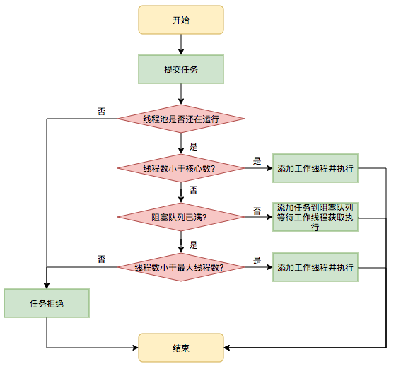

**线程池解决的问题是什么**  
**
线程池解决的核心问题就是资源管理问题。在并发环境下，系统不能够确定在任意时刻中，有多少任务需要执行，有多少资源需要投入。这种不确定性将带来以下若干问题：

1. 频繁申请/销毁资源和调度资源，将带来额外的消耗，可能会非常巨大。
2. 对资源无限申请缺少抑制手段，易引发系统资源耗尽的风险。
3. 系统无法合理管理内部的资源分布，会降低系统的稳定性。


```java
public ThreadPoolExecutor(int corePoolSize,
                          int maximumPoolSize,
                          long keepAliveTime,
                          TimeUnit unit,
                          BlockingQueue<Runnable> workQueue,
                          ThreadFactory threadFactory) {
    this(corePoolSize, maximumPoolSize, keepAliveTime, unit, workQueue,
         threadFactory, defaultHandler);
}
```

线程池 ThreadPoolExecutor 构造函数有 5 个参数，分别是：
**corePoolSize**：核心线程数  
**maximumPoolSize**：线程池最大线程数  
**keepAliveTime**：非核心线程存活时间  
**unit**：存活时间单位  
**workQueue**：工作队列（阻塞队列）  
**threadFactory**：线程工厂，用于创建线程  

核心线程会一直存活，即使在空闲状态。但如果设置了  **allowCoreThreadTimeOut** ，那么核心线程也会有超时。

线程池执行有 2 个方法，分别是 **submit** 和 **execute**，submit 内部也是调用 execute，区别在于 submit 方法有返回包装好的 Runnable：

```java
public Future<?> submit(Runnable task) {
    if (task == null) throw new NullPointerException();
    RunnableFuture<Void> ftask = newTaskFor(task, null);
    execute(ftask);
    return ftask;
}
```


**线程的创建方式：**  


1. 首先检测线程池运行状态，如果不是RUNNING，则直接拒绝，线程池要保证在RUNNING的状态下执行任务。  
2. 如果workerCount < corePoolSize，则创建并启动一个线程来执行新提交的任务。  
3. 如果workerCount >= corePoolSize，且线程池内的阻塞队列未满，则将任务添加到该阻塞队列中。
4. 如果workerCount >= corePoolSize && workerCount < maximumPoolSize，且线程池内的阻塞队列已满，则创建并启动一个线程来执行新提交的任务。
5. 如果workerCount >= maximumPoolSize，并且线程池内的阻塞队列已满, 则根据拒绝策略来处理该任务, 默认的处理方式是直接抛异常。




**execute：**

```java
public void execute(Runnable command) {
    if (command == null)
        throw new NullPointerException();
    //获得当前线程的生命周期对应的二进制状态码
    int c = ctl.get(); 
    //如果当前线程数小于核心线程数
    if (workerCountOf(c) < corePoolSize) {
        //则创建一个核心线程执行任务，创建成功直接返回
        if (addWorker(command, true))
            return;
        c = ctl.get();
    }
    //如果线程池状态是 Running，并且将任务添加到队列中成功
    if (isRunning(c) && workQueue.offer(command)) {
        int recheck = ctl.get();
        //判断线程池的状态,如果不是RUNNING状态,直接移除队列中
        if (! isRunning(recheck) && remove(command))
            reject(command);
        //如果当前线程数量为0,则单独创建线程,而不指定任务.
        else if (workerCountOf(recheck) == 0)
            addWorker(null, false);
    }
    //否则尝试创建一个非核心线程来执行任务,如果创建失败,调用reject()方法.
    else if (!addWorker(command, false))
        reject(command);
}
```


addWorker 方法就是创建线程的方法，addWorker 有两个参数。  
第一个参数 Runnable，如果指定，则是创建后执行的任务，如果为 null，则不指定任务，只是单独的创建线程。  
第二个参数 core，表示是否创建核心线程。

```java
private boolean addWorker(Runnable firstTask, boolean core) {
    retry:
    for (;;) {
        int c = ctl.get();
        int rs = runStateOf(c);  //线程状态

        // Check if queue empty only if necessary.
        if (rs >= SHUTDOWN &&
            ! (rs == SHUTDOWN &&
               firstTask == null &&
               ! workQueue.isEmpty()))
            return false;

        for (;;) {
            int wc = workerCountOf(c); //获取当前工作线程数量
            if (wc >= CAPACITY ||
                wc >= (core ? corePoolSize : maximumPoolSize))
                return false;
            if (compareAndIncrementWorkerCount(c))
                break retry;
            c = ctl.get();  // Re-read ctl
            if (runStateOf(c) != rs)
                continue retry;
            // else CAS failed due to workerCount change; retry inner loop
        }
    }
   //...
}
```

addWorker 逻辑分为 2 部分，第一部分是创建线程💰一些验证逻辑，第二部分是创建线程逻辑，先看第一部分，由两个 for 循环组成，这是里使用里 CAS 算法。
 
首先判断线程状态如果已经处于** STOP 或者即将 STOP 的状态 **或者 **处于 SHUTDOWN 状态，并且传递的任务 firstTask 为空，并且队列 workQueue 不为空的情况下，**直接返回 false，不需要创建线程。
（SHUTDOWN 是关掉的意思）

如果当前工作线程数量超多 CAPACITY 最大值，或者超多核心线程数或者最大线程数，不需要创建线程

compareAndIncrementWorkerCount 方法是判断 线程池状态的统计更新是否成功，成功就跳出循环继续执行

retry 类似 goto,是Java的标识符。

addWorker 创建线程部分：

```java
boolean workerStarted = false;
boolean workerAdded = false;
Worker w = null;
try {
    //Worker 是一个 Runnable ，包装了线程 Thread
    w = new Worker(firstTask);
    final Thread t = w.thread;
    if (t != null) {
        //加锁
        final ReentrantLock mainLock = this.mainLock;
        mainLock.lock();
        try {
            //获取线程池状态
            int rs = runStateOf(ctl.get());
			//只有线程池在 RUNNABLE 状态或者在 SHUTDOWN 状态并且任务为null时，添加线程
            if (rs < SHUTDOWN ||
                (rs == SHUTDOWN && firstTask == null)) {
                if (t.isAlive()) // precheck that t is startable
                    throw new IllegalThreadStateException();
                workers.add(w);
                //容量判断
                int s = workers.size();
                if (s > largestPoolSize)
                    largestPoolSize = s;
                workerAdded = true;
            }
        } finally {
            mainLock.unlock();
        }
        //如果线程已经添加成功，则调用start开始执行，并且设置标志 workerStarted
        if (workerAdded) {
            t.start();
            workerStarted = true;
        }
    }
} finally {
     //最后如果线程没有开始,就分发到添加线程失败,通过标志位来判断线程是否被添加成功.
    if (! workerStarted)
        addWorkerFailed(w);
}
//如果添加成功就返回true,否则添加失败就返回false.
return workerStarted;
}
```

1. Worker 实现了 Runnable，并且包装了由线程工厂创建的线程 Thread
2. 添加线程的过程是加锁的
3. 只有在线程池为 RUNNABLE 状态或者在 SHUTDOWN 状态并且任务为 null 时，才会添加线程
4. 添加成功会修改标志位 workerAdded 为 true，并且调用线程的 start 方法开始执行，并修改 workerStarted 为 true
5. 如果 workerStarted 为 false，即线程执行没开始，则分发到添加线程失败逻辑

**Worker**

```java
final Thread thread;

Worker(Runnable firstTask) {
    setState(-1); // inhibit interrupts until runWorker
    this.firstTask = firstTask;
    this.thread = getThreadFactory().newThread(this);
}
```
**
之前说到， Worker 实现了 Runnable，并且包装了由线程工厂创建的线程 Thread，当调用 start 方法开始执行任务时，会回调 Worker 的 run 方法，最后执行 runWorker 方法：

```java
public void run() {
    runWorker(this);
}
final void runWorker(Worker w) {
    Thread wt = Thread.currentThread();
    Runnable task = w.firstTask;
    w.firstTask = null;
    w.unlock(); // allow interrupts
    boolean completedAbruptly = true;
    try {
        while (task != null || (task = getTask()) != null) {
            w.lock();
            //中断判断
            if ((runStateAtLeast(ctl.get(), STOP) ||
                 (Thread.interrupted() &&
                  runStateAtLeast(ctl.get(), STOP))) &&
                !wt.isInterrupted())
                wt.interrupt();
            try {
                beforeExecute(wt, task);
                Throwable thrown = null;
                try {
                    task.run();
                } catch (RuntimeException x) {
                    thrown = x; throw x;
                } catch (Error x) {
                    thrown = x; throw x;
                } catch (Throwable x) {
                    thrown = x; throw new Error(x);
                } finally {
                    afterExecute(task, thrown);
                }
            } finally {
                task = null;
                w.completedTasks++;
                w.unlock();
            }
        }
        completedAbruptly = false;
    } finally {
        processWorkerExit(w, completedAbruptly);
    }
}
```

1. 循环调用 getTask 方法从任务队列中获取新任务。
2. 如果池正在停止，请确保线程被中断； 如果没有，请确保线程不被中断。 这需要在第二种情况下重新检查以处理shutdownNow竞赛，同时清除中断.
3. beforeExecute 和 afterExecute 分别可以在执行任务前后做些操作
4. 线程退出后，调用 processWorkerExit 做后续处理

**线程池的复用**  
 
线程池线程复用需要看到在队列中取线程的方法 getTask

```java
private Runnable getTask() {
    boolean timedOut = false; // Did the last poll() time out?

    for (;;) {
        int c = ctl.get();
        int rs = runStateOf(c);

        // Check if queue empty only if necessary.
        if (rs >= SHUTDOWN && (rs >= STOP || workQueue.isEmpty())) {
            decrementWorkerCount();
            return null;
        }

        int wc = workerCountOf(c);

        // Are workers subject to culling?
        boolean timed = allowCoreThreadTimeOut || wc > corePoolSize;

        if ((wc > maximumPoolSize || (timed && timedOut))
            && (wc > 1 || workQueue.isEmpty())) {
            if (compareAndDecrementWorkerCount(c))
                return null;
            continue;
        }

        try {
            Runnable r = timed ?
                workQueue.poll(keepAliveTime, TimeUnit.NANOSECONDS) :
            workQueue.take();
            if (r != null)
                return r;
            timedOut = true;
        } catch (InterruptedException retry) {
            timedOut = false;
        }
    }
}
```

1. 启动一个死循环，首先判断一下线程池状态，仅在必要时检查队列是否为空，如果空则返回 null
2. 通过 timed 判断是否开启时间检测机制，如果设置了 allowCoreThreadTimeOut 或者工作线程数大于核心线程数则开启。
3. 如果 timed 为 true 则通过阻塞队列的** poll(long timeout, TimeUnit unit) **方法在时间 keepAliveTime 内取出元素，否则直接调用 take 方法取出。
4. 如果取出成功，则返回，否则标记为 timedOut 超时

总结：任务在并不只执行创建时指定的 firstTask 第一任务，还会从任务队列的中自己主动取任务执行，而且是有/无时间限定的阻塞等待，保证线程的存活。


**拒绝策略**

在 execute 方法中，如果 addWorked 失败，则会调用 reject(Runnable command) 方法：

```java
final void reject(Runnable command) {
    handler.rejectedExecution(command, this);
}
```

handler 的类型是 RejectedExecutionHandler，是一个接口，默认有四个实现，即 4 种拒绝策略：

| 实现类 | 说明 |  |
| --- | --- | --- |
| CallerRunsPolicy | 由调用线程执行新任务 |  |
| AbortPolicy | 丢弃新任务，并抛出 RejectedExecutionException |  |
| DiscardPolicy | 不做任何操作，直接丢弃新任务 |  |
| DiscardOldestPolicy | 丢弃队列队首元素，并执行新任务 |  |


线程池默认实现的拒绝策略是** defaultHandler = AbortPolicy，**可以通过构造函数或者 setRejectedExecutionHandler 方法修改。

**android 中常用的线程池分类**
 
FixedThreadPool

```java
 public static ExecutorService newFixedThreadPool(int nThreads) {
     return new ThreadPoolExecutor(
         nThreads, nThreads,
         0L, TimeUnit.SECONDS,
         new LinkedBlockingQueue<Runnable>()
     );
 }
```

特点：核心线程数和最大线程数相等，即全部都是核心线程。没超时时间。这意味这它能够更快速的响应外界请求。排队策略使用 LinkedBlockingQueue

CacheThreadPool

```java
public static  ExecutorService newCacheThreadPool(){
    return  new ThreadPoolExecutor(
        0,Integer.MAX_VALUE,
        60L,TimeUnit.SECONDS,
        new SynchronousQueue<Runnable>()
    );
}
```

特点：没有核心线程，线程数最大是 Integer.MAX_VALUE，超时时间是 60 秒，意味着当线程池里面所有线程都处于活跃状态时，才会新建线程去执行任务，否则都是复用空闲线程去处理，比较适合处理大量且耗时较短的任务。排队策略是 SynchronousQueue

ScheduledThreadPool

```java
public ScheduledThreadPoolExecutor(int corePoolSize) {
    super(corePoolSize, Integer.MAX_VALUE,
          DEFAULT_KEEPALIVE_MILLIS, MILLISECONDS,
          new DelayedWorkQueue());
}
```

特点：指定核心线程数，即核心线程数是固定的，线程数最大也是  Integer.MAX_VALUE，超时时间也是固定的，排队策略是 DelayedWorkQueue，适合用于执行定时任务和具有固定周期的重复任务。

SingleThreadExecutor

```java
public static ExecutorService newSingleThreadExecutor() {
    return new FinalizableDelegatedExecutorService
        (new ThreadPoolExecutor(1, 1,
                                0L, TimeUnit.MILLISECONDS,
                                new LinkedBlockingQueue<Runnable>()));
}
```

特点：核心线程数和最大线程数都是 1 ，即只有一个核心线程。没有超时时间。排队策略是 LinkedBlockingQueue，它能确保所有任务都在同一个线程内顺序执行，使得这些任务之间不需要处理线程同步问题。

**排队策略**
 
上面说到的不同排队策略对应着不同的阻塞队列实现：

| 实现类 | 类型 | 说明 |
| --- | --- | --- |
| LinkedBlockingQueue | 无界队列 | 基于链表的阻塞队列，按照FIFO原则对元素排序 |
| SynchronousQueue | 同步队列 | 不存储元素，每个插入操作必须等待另一个线程调用移除操作，否则插入操作会一直阻塞 |
| DelayedWorkQueue | 无界阻塞延时队列 |  |


[https://mp.weixin.qq.com/s/baYuX8aCwQ9PP6k7TDl2Ww](https://mp.weixin.qq.com/s/baYuX8aCwQ9PP6k7TDl2Ww)
